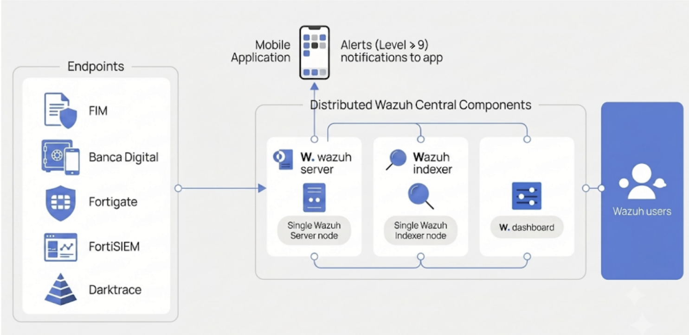
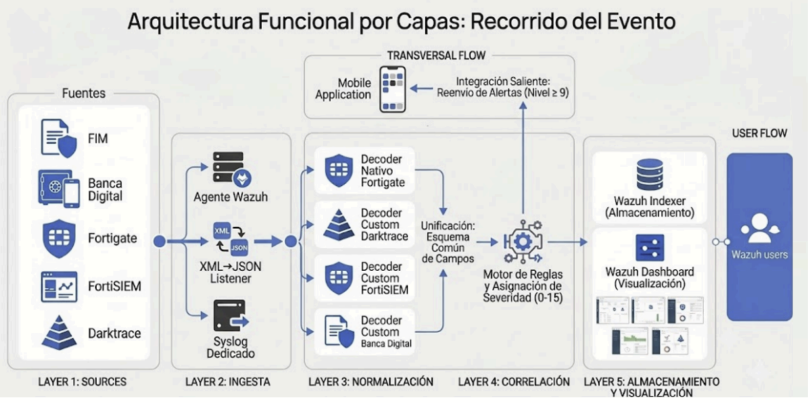

# SIEM Wazuh — Integraciones Custom (FortiGate, FortiWeb, Darktrace, FortiSIEM, Banca Digital)

Proyecto académico de implementación de un SIEM basado en **Wazuh**, con desarrollo de
decoders, reglas y una integración custom para el envío de alertas críticas a una
aplicación móvil de notificación de seguridad.

> **Alcance de este repositorio:** este proyecto documenta únicamente los módulos que
> desarrollé/configuré yo: decoders y reglas para **FortiGate**, **FortiWeb**,
> **Darktrace**, **FortiSIEM** (vía listener custom XML→JSON) y **Banca Digital**
> (auditoría transaccional), más la integración de alertas hacia una app móvil.
> No cubre la administración general del clúster Wazuh (managers, indexer, dashboard),
> solo la capa de ingestión, normalización, correlación (reglas) y notificación.

---

## 📐 Arquitectura de Wazuh implementada

---
## 📐 Arquitectura funcion por capaz

---

## 🧩 Módulos documentados

| Módulo                    | Tipo de log                      | Decoder                                      | Reglas (rango ID)           | Salida                                            |
| ------------------------- | -------------------------------- | -------------------------------------------- | --------------------------- | ------------------------------------------------- |
| **FortiGate**             | Syslog                           | decoders nativos de Wazuh (`81629`, `81612`) | `100050`, `100300`–`100303` | Alertas IPS crítico/alto/medio, cambios de config |
| **FortiWeb** (WAF)        | Syslog key=value                 | `fortiweb.xml` (custom, ~50 campos)          | `100990`, `100992`          | Alertas de ataque nivel HIGH                      |
| **Darktrace**             | CEF                              | `Darktrace.xml`                              | `100100`                    | Alertas de anomalías de red/NDR                   |
| **FortiSIEM**             | XML → JSON (vía listener propio) | `fortisiem.xml` (`log_format=json`)      | `190102`                    | Alertas por severidad 8–10                        |
| **Banca Digital**         | JSON (auditoría transaccional)   | `BancaDigital.xml` (`CortexAuditWorker`)     | `110200`–`110229`           | Fuerza bruta, ATO, geo-anomalías, montos altos    |
| **Integración app móvil** | N/A (consumidor)                 | —                                            | dispara con `level >= 9`    | Push al backend "app"                             |

Ver el detalle de cada uno en `docs/`.

---

## ⚙️ Requisitos

- Wazuh Manager (probado en versión 4.14)
- Python 3.8+ (para el listener de FortiSIEM y la integración custom)
- Librería `requests` (`pip install requests`)
- Acceso de red UDP/TCP desde los dispositivos FortiGate/FortiWeb/Darktrace/FortiSIEM/Banca Digital hacia el manager

---

## 🔒 Notas de seguridad

- **Nunca** se debe versionar el `AUTH_TOKEN` real ni URLs internas con credenciales.
  El script en este repo usa `os.getenv("APP_AUTH_TOKEN")`.
- Los `allowed-ips` de los `<remote>` deberían restringirse a las IPs reales de los
  dispositivos emisores en lugar de `0.0.0.0/0` en un entorno de producción.
- Este repositorio es de carácter **académico/demostrativo**; los nombres de host,
  dominios e IPs reales de la organización fueron reemplazados por placeholders.

---

## 👤 Autor

Celso Jimenes Obando
